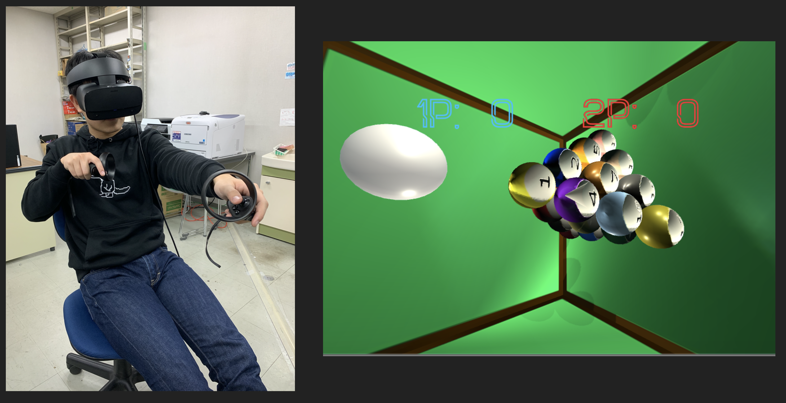

# Reflect_Cube
立方体の中で行うビリヤードのようなVRゲームです．

## Description
ボール
- 上から1,3,6,10の4層のピラミッド型で合計20個プラス白玉があります．

ルール
- プレイヤー棒（キュー）を持ち白い玉を売って数字がかかれているボールを打ちます．
- ボールの数字がボールのHPになっています．
- 壁に当てるとボールのHPが１ずつ減ります．
- ボールのHPを0にするとボールが消えます．
- ボールを消した人がボールの最大HP分を得点として獲得します．
- ボールを打つのは一回づつで交代です．
- ボールが全て消えたときに特典が高い人が勝利です．

人数
- 2人

## Demo

## Requirement
- Oculus Rift S
- Unity
- Windows 10

## Usage
1. Build by Unity.
1. Execute exe file.

## Licence

[MIT](https://github.com/tcnksm/tool/blob/master/LICENCE)

## Author
- kbys (https://github.com/rideonkb)
- lanqiu (https://github.com/lanqiugit)
- masapyon (https://github.com/ocucraqp)
